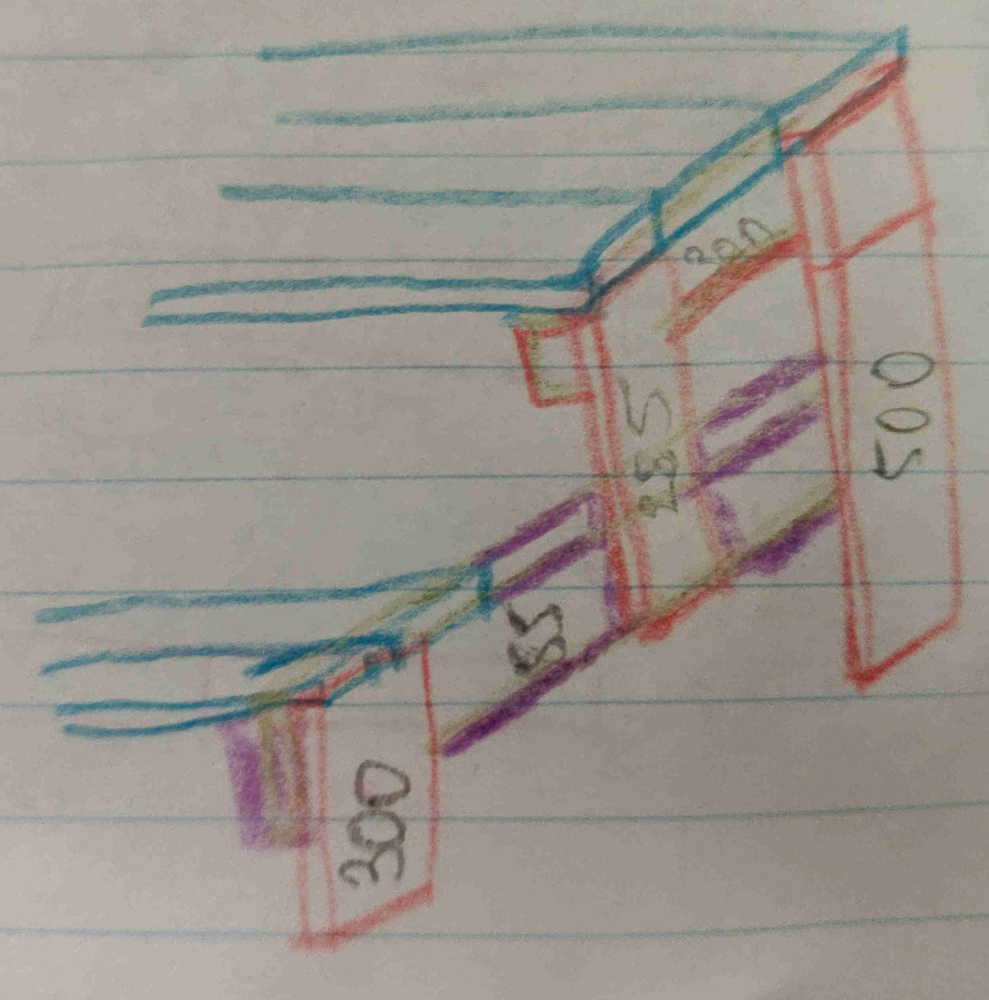
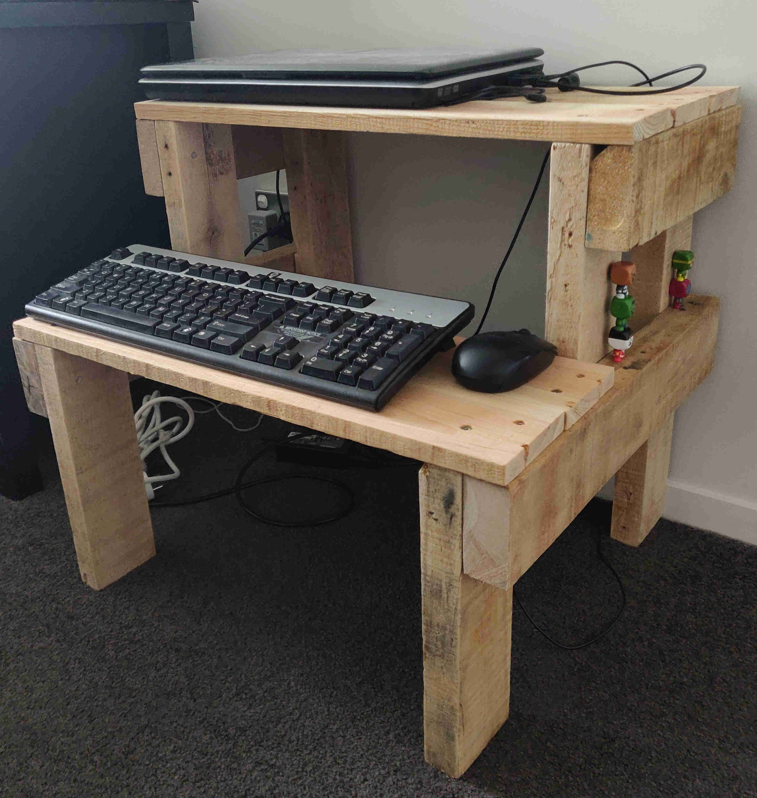
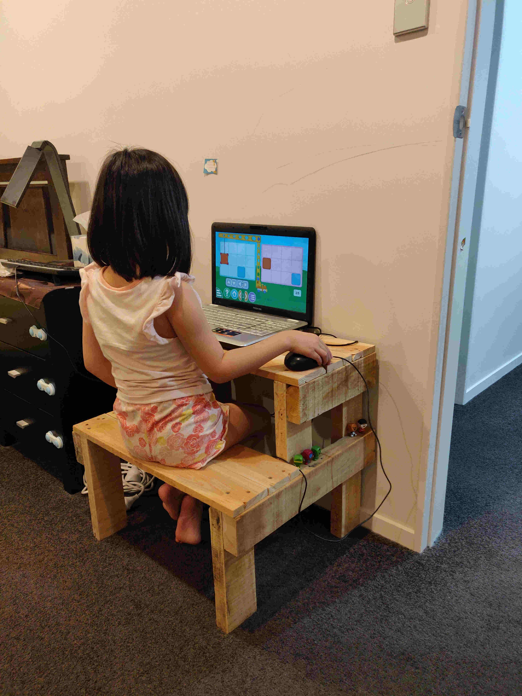

Project Date: September 2021

When using my personal laptop, I have been using it on top of a box while sitting on the floor. The sitting on the floor is not too bad, as I don't tend to use my laptop for much apart from updating this blog. However, I've been thinking for a while now that it would be nice to replace the box with a better mini desk (but I would still be sitting on the floor). I could then make a platform to be able to use a keyboard (and not just the laptop keyboard). 

I hunted around my garden shed to find suitable pallet wood, and my plan had to be designed based on what was available. I sketched out a few designs before settling on one, from which I then colour coded the sketch based on the three different pallet wood thicknesses I had.

The blue planks were the thinner planks that make up the pallet loading surface. I only had 3 of these planks and I needed 6 for this table, so I had to make the width of the table half the length of these planks in order to have enough. The orange and purple were the structural braces from pallets, but the purple ones are slightly thicker (and denser) than the orange.

Now I can use this set up to write future blog posts!

Update: My daughter discovered that she could sit on the keyboard stand to play games.

  

