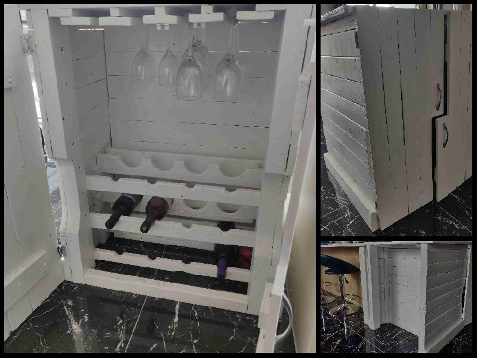
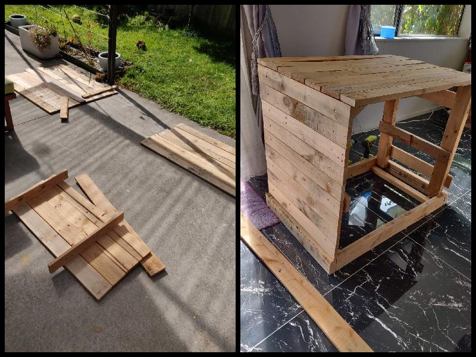
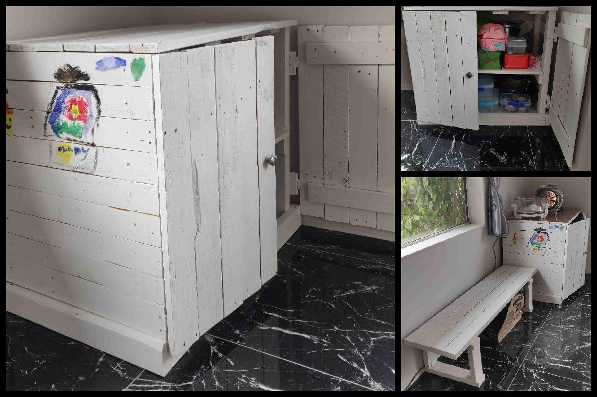

Project Date: 2013/2021

# Wine cabinet
We wanted to extend the kitchen island to have more benchtop to use. Back then, my wife also liked to drink wine. Thus came the idea to make a wine cabinet to place at the end of the kitchen island. Taking a cue from the kitchen island, I made the bar stool side of the cabinet to match and be able to fit another bar stool. On the inside, I used a hole saw to cut half circles out of some pallet wood to make the three racks to store a total of 12 bottles of wine. I also made a slot arrangment to hang wine glasses from the top, upside down.

# Kitchen cabinet
In one corner of the kitchen, we had been using an old dining table to store pots and pans underneath, with an air fryer and convection oven on top. We wanted to replace the dining table with a cabinet. At first, we thought to get a proper kitchen cabinet built, but somehow, we never got around to contacting a designer. Then we looked around for any off the shelf cabinets, but couldn't find one of the correct dimensions. After about a year of procrastination, I finally started to plan out a cabinet. The drawing was a simple sketch with the 3 dimensions (width, height, and depth). The starting point was a baby change table I had made (unfortunately I do not have photos of this - I actually made two change tables, one having a flip top that could be raised to reveal a baby bath tub). I then hunted around my dissassembled pallet wood storage to find suitable wood for the construction. The sum total of wood from the change table and storage was enough for most of a kitchen cabinet. Seeing as the cabinet was going to be in a corner, I could sacrifice a back and a side wall.

Once the cabinet was built, my daughter helped to paint it first with white paint, and then she decorated it with her coloured paints. Placing (and painting to match) a bench seat I had previously made beside the kitchen cabinet has tidied up the kitchen corner.

  

  This page has been read ... times.

