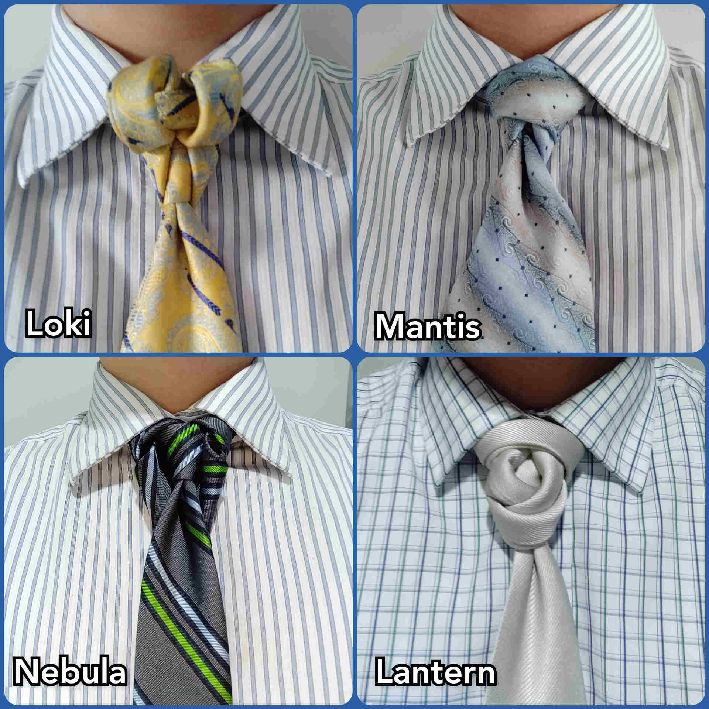
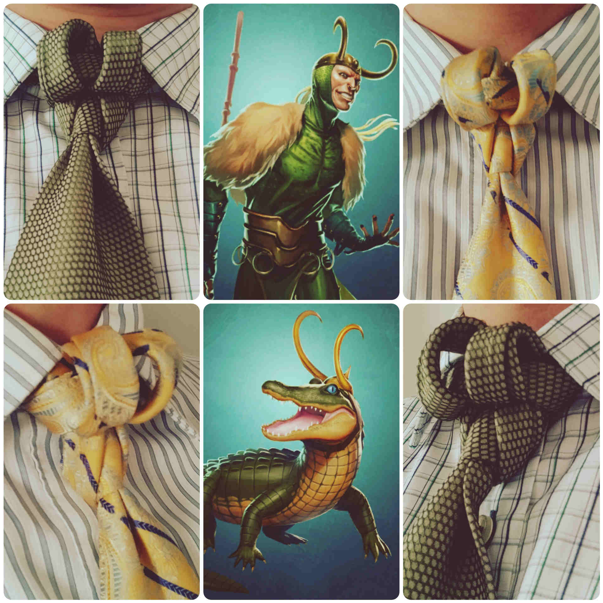

In this small collection, I have grouped together some tie knots with superhero type names. Three from the MCU (one of these a villian) and one from the DC universe.

I quite like the Loki knot, especially viewed from the side. I think that the knot does look like the horns from Loki's crown, and the two colours I tried this knot in reminded me of artwork for Loki from a mobile game, [Marvel Puzzle Quest](https://www.marvel.com/games/marvel-puzzle-quest){target="_blank"}.

  

  This page has been read ... times.

