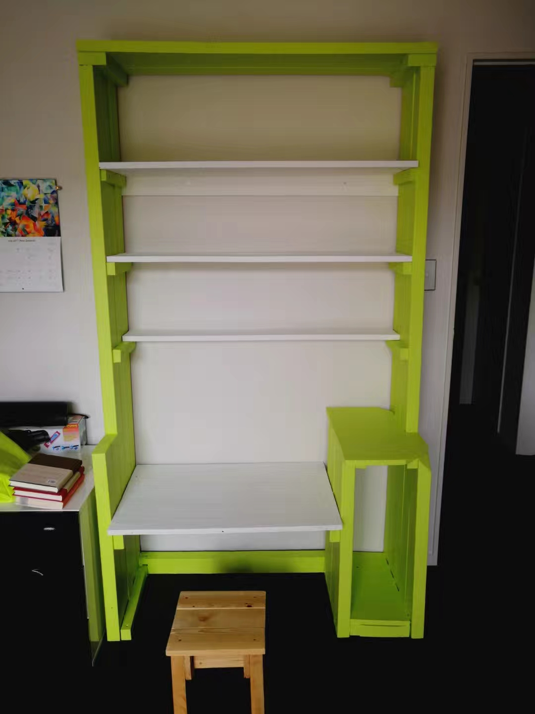

Project Date: 2018

I prefer physical paper books compared to ebooks, so am always in need of more book shelf space. I also thought it would be great to have a desk for my daugther. So, I combined these into one project.

The long 2 x 4's that form the side walls aren't from pallets. I obtained them from my parent's neighbours who had finished building an extension to their house. The wood was untreated (good) and not completely flat (not so good - but I made do). Some of my pallets had plywood instead of the more conventional spaced planks, which came in handy for the desk top.

I didn't have a good reason for it, but I decided to make a space that would fit a PC tower case. I also wanted to be able to move the desk height to accomodate my daughter as she grows. I didn't make a mechanism for the hieght adjustment, but the screws can be easily removed from the desk top support and reattached at the required height. 

Also in the picture is one of many stools that I made from pallets that are scattered around my house.

  

  This page has been read ... times.

