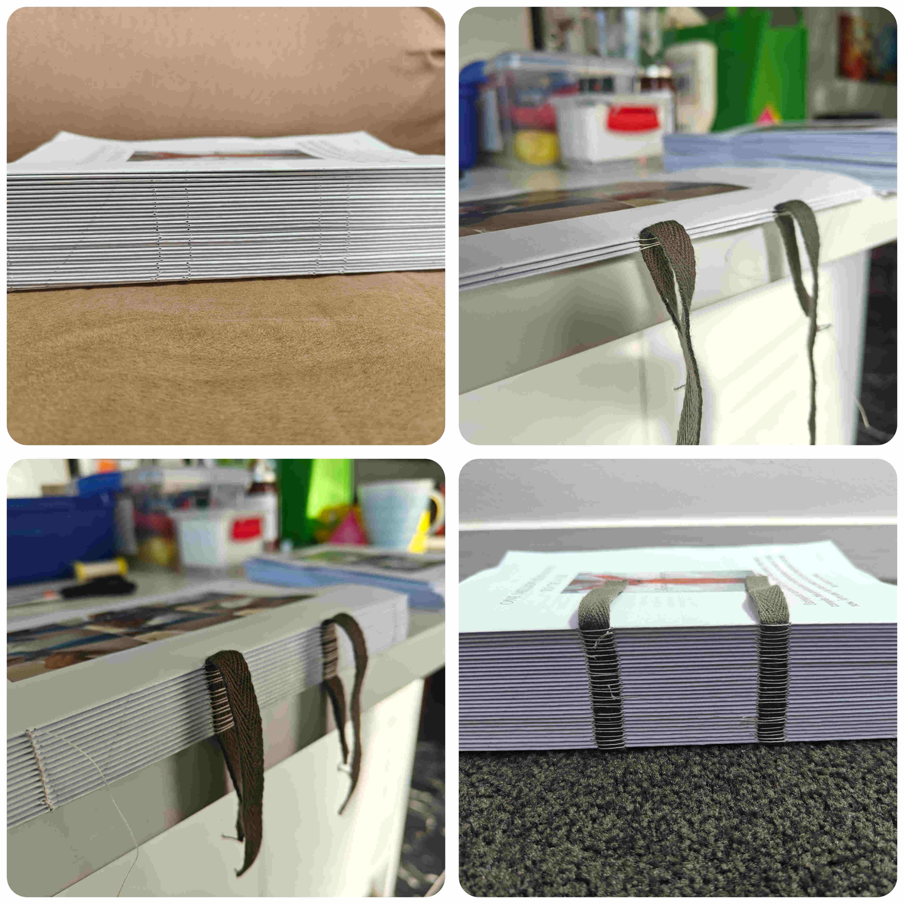
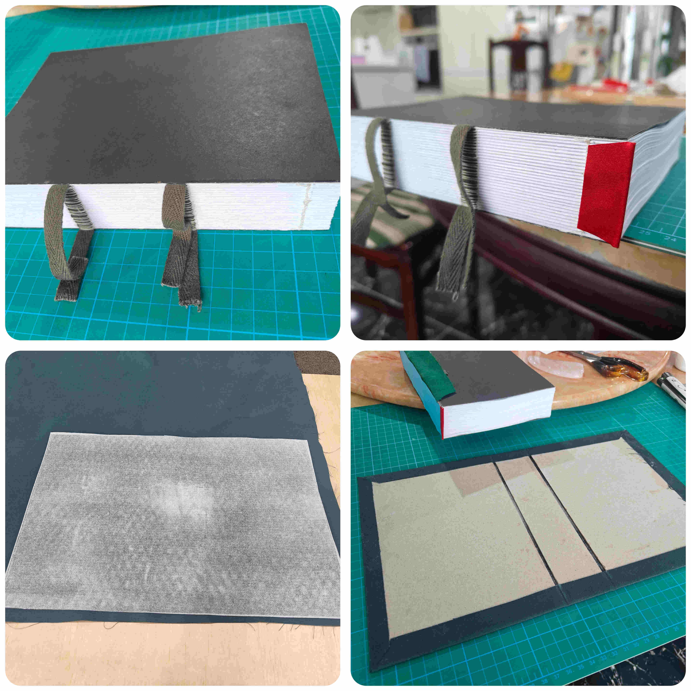
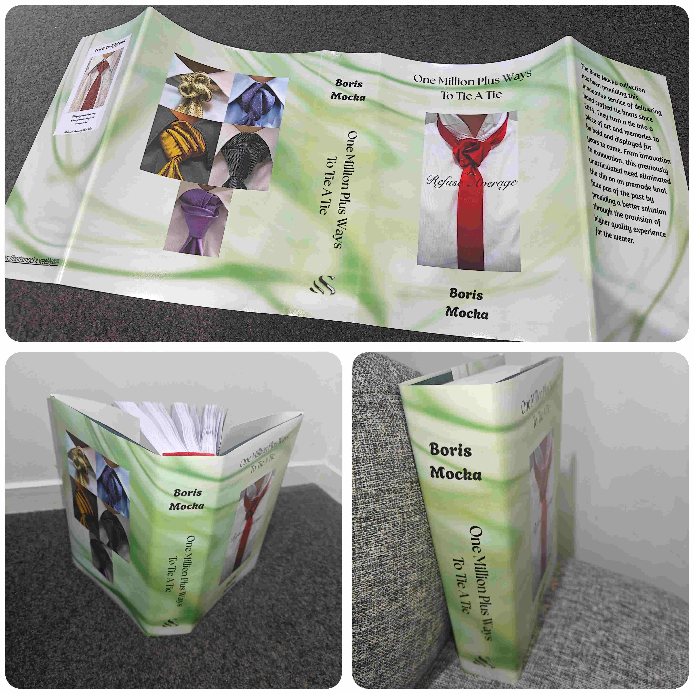

Project Date: July 2025

I don't remember how I came across Boris Mocka, but I found out that he has invented many ways to tie a tie. I found his [official website](https://borismocka.weebly.com/){target="_blank"}  and saw that he has a few books that he wrote with step-by-step images on how to tie some really cool tie knots. Though the price was quite high, I decided to treat myself and buy his second book, "One Million Plus Ways to Tie a Tie".

I didn't realise that it was going to be a digital file instead of an actual physical book, so I was surprised when I immediately received a pdf attachment to my email upon payment. After a brief moment of shock, I remembered that I had done [book binding before](https://bengin.netlify.app/posts/in-search-of-the-dark-tower/){target="_blank"}  and saw this as a new project to work on!

# Imposition
I initally thought to use Latex like I previously did for imposition of the signatures. However, it had been so long since I used Latex that I decided to look up alternatives. I found [Bookbinder JS](https://momijizukamori.github.io/bookbinder-js/){target="_blank"}  which allowed me to upload the pdf and configure it so that I would receive an imposed output file ready for printing and collating into folded signatures.

# Printing
The next step was to print the book. Looking online, it was going to cost a lot to print the book out in colour. Luckily, I have a colour laser printer at home. The quality of the image is not of the highest quality that professional printing would have been, but it was much much more cost effective.

My printer can print both sides and can duplex print automatically flipping the page. However, after a few pages, the printer jammed. So, I had to take all the paper out of the tray, and use the manual feed one page at a time and flip the page manually. This took well over 6 hours to get fully printed, spread over 2 weeks.

# Sewing
Before sewing the signatures together, I folded and stacked the signatures, and placed them under a large stack of books for a week to compress the pages.

Then to sew the signatures, I used the same technique as previous and referring back to [DAS book binding](https://www.youtube.com/watch?v=QBDv_63JCmw){target="_blank"}.

# Head banding and Hard Cover
I found out about head bands and looked at ways to do this. I settled on a more simple method (compared to sewing a head band) where I used some twine, some cloth, and glue.You can see this in one of the images below where the red headband is glued to the spine.

To create the hard cover, I made my own book cloth by buying some Heat 'N' Bond to iron on tissue paper to a green cotton fabric I had. The tissue paper and Heat 'N' Bond help to prevent the PVA from seeping through to the fabric when glueing the book board.

# Dust Jacket
With the book bound into a hard cover, the final step was to create a dust jacket. I used Canva for this. I designed the layout myself, and kept true to Boris Mocka by using elements from his webiste to design it in the way I saw it as if I had purchased the book as a physical copy. During the design, I made a mistake and placed the inside flap contents in the wrong place; they were switched.

I took the file to Warehouse Staionary to print this in high quality. The end result can be seen below.

  

  This page has been read ... times.

