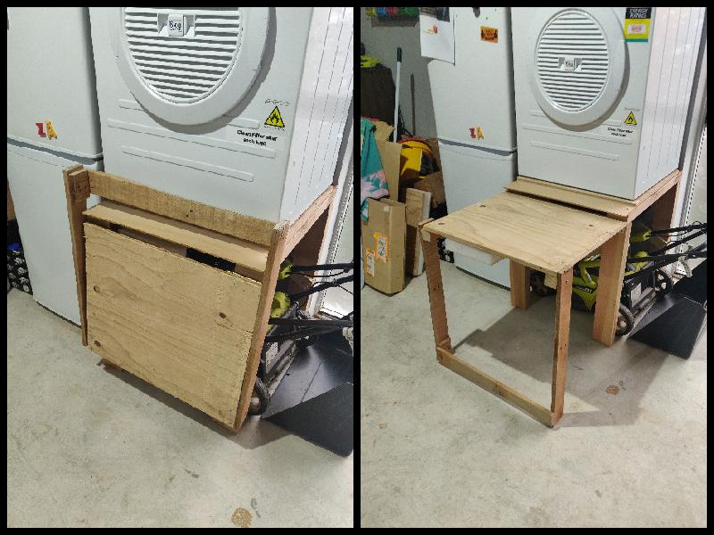

Project Date: July 2019

When I had to move the clothes dryer out from the laundry and into the garage, there wasn't any floor space for it. I didn't want to attach the dryer to the wall, therefore I made a table that could fit my battery powered lawn mower underneath. 

Having the clothes basket on the floor while loading and unloading the dryer resulted in the occasional clothing item being dropped onto the floor. Due to the limited space, I couldn't have a permanent laundry table. Thus came the idea for a foldout table.

This table has worked well not only for it's original intended purpose, but also as a general work bench. I've used it when soldering, drilling, sawing, and sanding. 

  

  This page has been read ... times.

