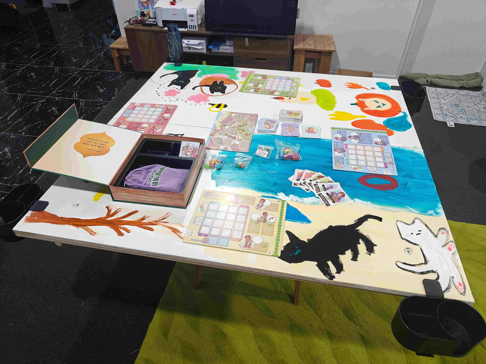
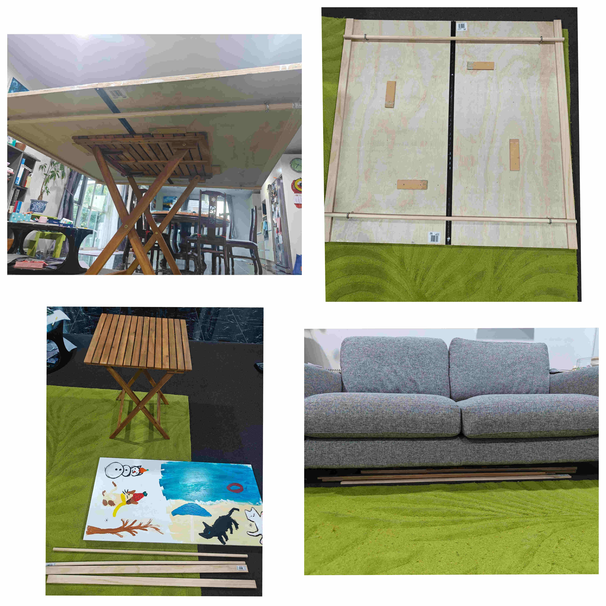
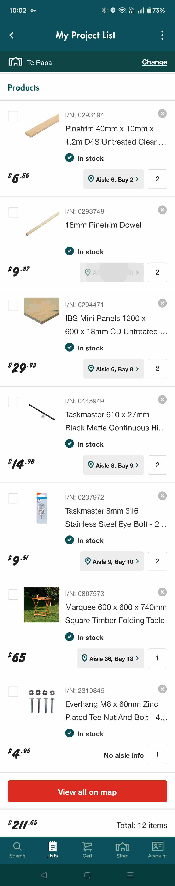

Project Date: February 2026

I started playing Monster Hunter Now (after starting with Ingress and then Pokemon Go) and my daughter then wanted to play too.

I wasn't aware of the other mainline Monster Hunter games, but I somehow came across Monster Hunter World the board game. So, because we both like MH Now, we bought the board game.

We played a few times on the floor, and the last time we played it, our cat sat down in the middle of our game. We were not able to continue, so I started to think of how to avoid this problem again. I had heard of fancy custom table top gaming tables which did look good, but there was nowhere in the house to put a large custom table. I kept thinking, then came to the idea of a folding table that can be put away under the couch.

# Finished table

Here are some images of the finished table. My daughter painted the top with a theme of cats in the four seasons.

The image above shows us playing a board game we bought from Kickstarter, "Cozy Cat Cafe". You can see in the photo that we bought some removable cup holders to attach so we can have drinks while playing!

The next collage of images shows the table though it's various stages of transformation to be able to fit under the couch.

# Parts and Construction
I started the design by looking for a foldable table that wasn't too expensive. I found an outdoor folding table that was 600mm sqare, which was not going to be big enough to play board games. I then found plywood thw as 1200 x 600mm. That size would fit under the couch nicely, so two sheets that could fold on top of each other when unfolded would give a nice big 1200mm square table top. I did some research and found that it was recommended to use a continuous hinge as opposed to just a few regular hinges. So, I bought those to start with and attached the hinges to the two sheets of plywood to fold up perfectly. However, when unfolded an placed on top of the smaller table, the weight and overhang caused the table to bend and not sit flat.

Referring to the images above, you can see that I had to come up with some supports on the underside to:

1. keep the plywood table top from sliding
2. keep the plywood table top flat

The bottom left image in the collage above shows the table disassembled and ready to stow under the couch.

  

  This page has been read ... times.

