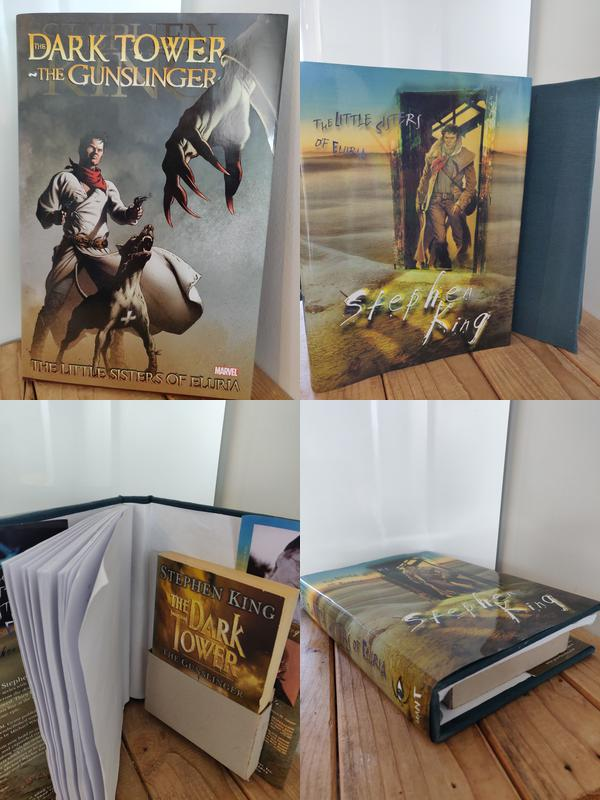

Project date: December 2017

After reading 'The Dark Tower' series by Stephen King, I found out about a novella "Little Sisters of Eluria" set just before "The Dark Tower: The Gunslinger". I just had to get my hands on a copy, so I searched the web and found a [free online version](https://thefreenovelsread.com/243334-the-little-sisters-of-eluria){target="_blank"} of the novella.

However, I wanted a physical copy, and so I ordered a [copy from Amazon](https://www.amazon.com/Dark-Tower-Gunslinger-Little-Sisters/dp/0785149317){target="_blank"}. When it arrived, I opened it, and it was a comic (note the "marvel" logo in the top-left image of the collage below)!

I really wanted the novella, so I continued my web search that led me to a [website](https://secure.grantbooks.com/books/little-sisters-of-eluria/){target="_blank"} where I again purchased what I thought was the novella. The parcel that arrived was a tube, which seemed incredibly strange. Opening the tube and tipping the contents out yielded a dust cover!

After the feeling of disappointment had faded, Eureka! Free online version + dust cover = bind my own book. The steps involved:

1. Copy the text from the free website into LaTeX files
2. Use [pdfpages](https://www.ctan.org/pkg/pdfpages){target="_blank"} package to print the book formatted into [signatures](https://en.wikipedia.org/wiki/Section_(bookbinding){target="_blank"})
3. [Stitch](https://www.youtube.com/watch?v=QBDv_63JCmw){target="_blank"} the signatures together
4. Make a cloth covered hard cover
5. Make a pouch to hold "The Gunslinger"
6. Combine all the elements

It turns out that the dust cover was for a special hard-back edition that included "Little Sisters of Eluria" along with "The Gunslinger", and hence, the dust cover spine was bigger than the printed pages of the novella. So, in step 1 above, I increased the text size to end up with more pages. The combined signatures was still too thin, so I decided to create a pouch to hold my copy of "The Gunslinger".

  

  This page has been read ... times.

