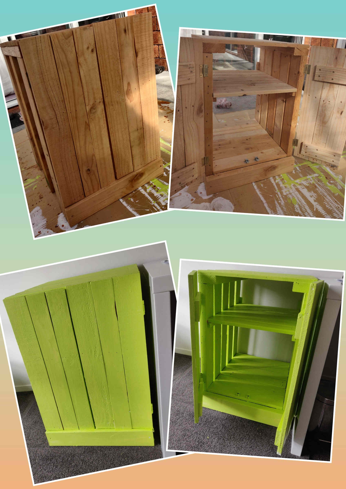
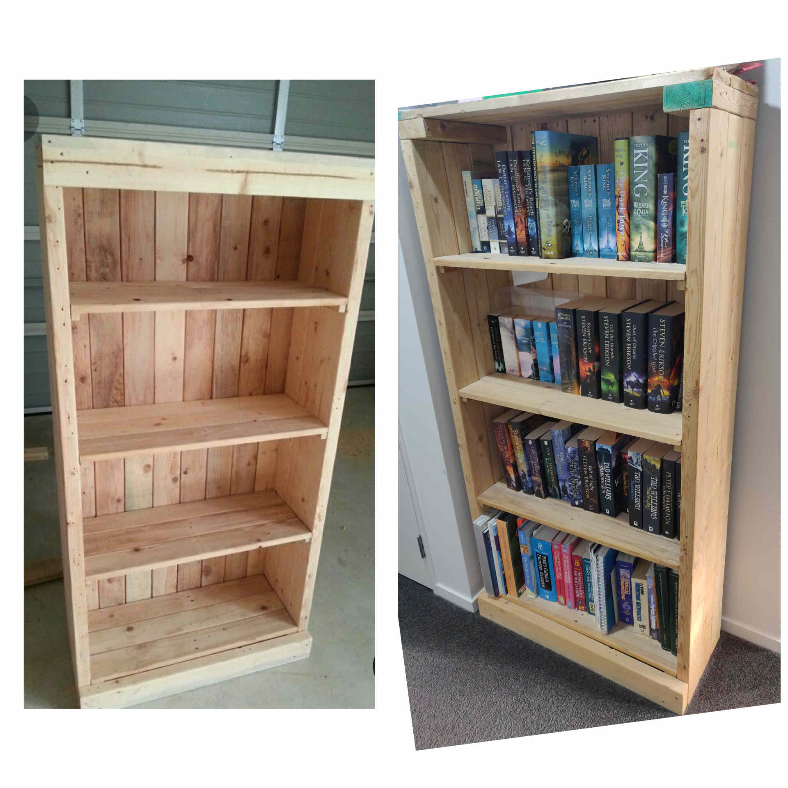

Project Date: 2012/2013

# Office cabinet
Before moving my desk out to the living room and converting it into a [stand-up desk](/post/pallet-standup-desk), it used to be located in the study, along with my wife's desk. These desks were positioned side by side against one wall. We bought a printer, and needed somewhere to put it, and we decided the best positioning would be to be between the two desks. I also needed somewhere to store files, so I decided to make an office cabinet from pallets. To save on wood, I did not make a back for it, as it would be against the wall, and I also left gaps between the vertical boards that made up the side walls.

# Bookcase
Strictly speaking, this is not really office furniture, and it is also not in the office. Instead, it is located in the hallway, perfectly nestled in a small semi-alcove. I have probably spent the most time on this project build than any other. I took more care sanding each piece of wood to get it smoother. I also used dowels to attach the shelving supports with the boards not secured.

  

  This page has been read ... times.

