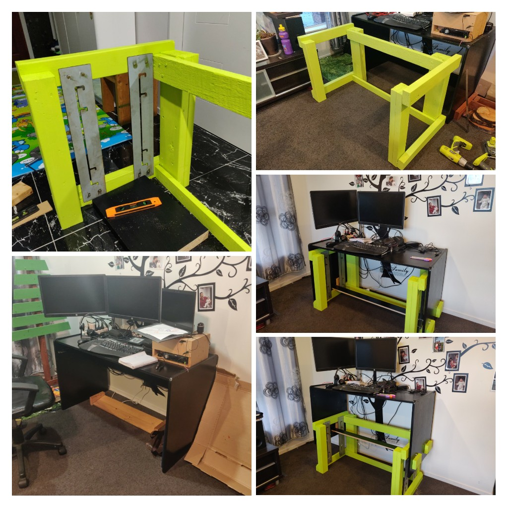

Project date: April 2020

At work, I got used to having a desk that I could move up and down so that I could sit or stand to do work. Covid-19 meant working from home, and after a week of sitting all the time, I wanted to be able to stand up at my desk again.

A colleague sent me a link to a flatpack stand up [desk](https://www.workfromhomedesks.co.nz/){target="_blank"} that when assembled, stayed in one position, and she suggested I could make one like that. That got me thinking about how I could modify my existing desk to be able to move up and down. I came up with the idea that I could make a frame that sits under my desk with a track that would allow for the desk to move up and down then securely stay at a pre-defined level.

What triggered me to actually make it was that my colleague said that her partner could supply steel plates with the track cut out. Some back and forth cemented the idea, and my initial intent of waiting for the lockdown level to reduce so that I could buy some wood to make the frame went out the window, and I searched through my pallet wood stash to find suitable materials to make the frame. Over a long weekend, I put the frame together and then confirmed the required dimensions of the steel plates. 

Contactless delivery of the plates was made (along with bolts, nuts, and washers). A number of trial and error adjustments were made to the desk (due to no forward planning for relocating structural components of the desk) before it could be raised and lowered.

  

  This page has been read ... times.

