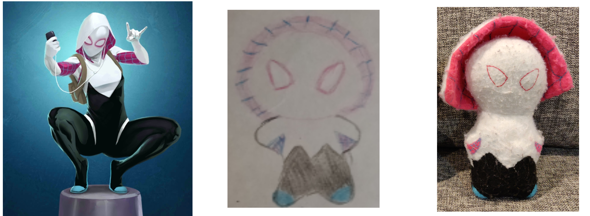
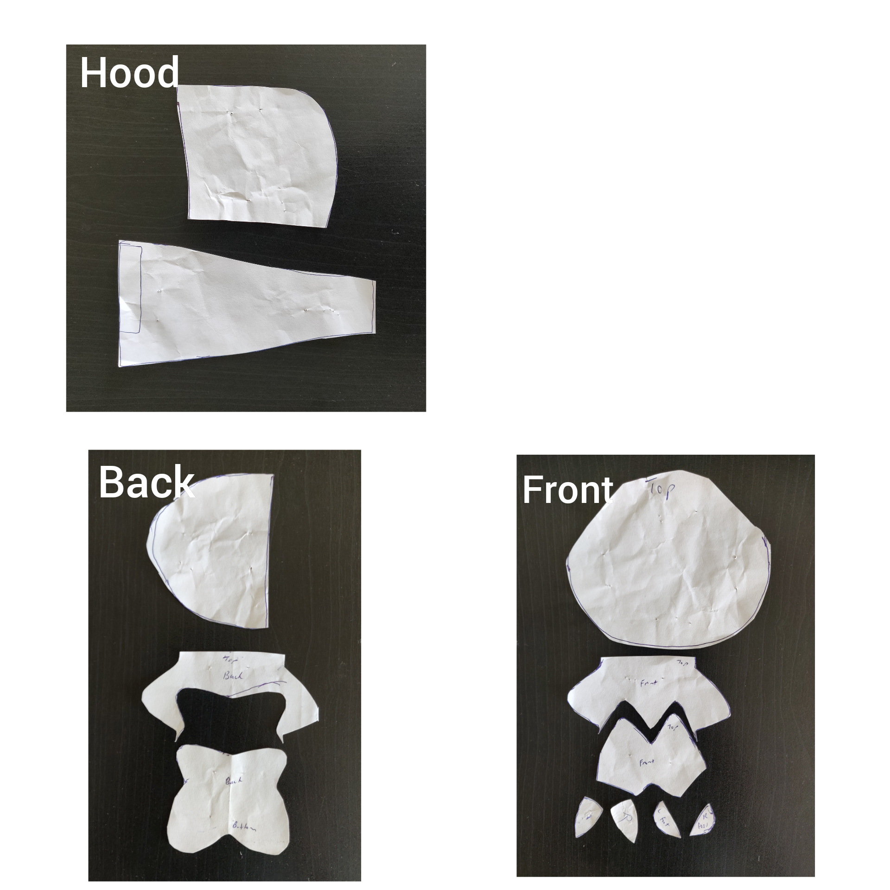

Project Date: 2016

I'm a huge fan of Spiderman and the Spidervese, and I thought it would be cool to give my daughter a Spider-Gwen soft toy. I couldn't find one anywhere to purchase, so, it was time to dust off my sewing skills. The image below shows an image taken from the mobile game "Marvel Puzzle Quest", my interpretation drawing to simplify it, and then my final soft toy.

I made a pattern on paper and tested it out on some srap fabric. For the hood, I found a pattern online that I copied to the size I required (lucky guess that came out right size during the test run with scrap fabric).

I then proceeded to buy some felt and coloured thread. The hood was the most time consuming part of this project. It consists of two layers: a white outer layer, and a pink inner layer. I hand stitched the blue thread to create the spider web pattern on the inside of the hood. The hood was also tricky to position correctly to sew, as sewing is done on the inside of the body to hide the seam. Therefore, when the body is turned inside out, the hood has to pop out in the correct orientation.

  

  

