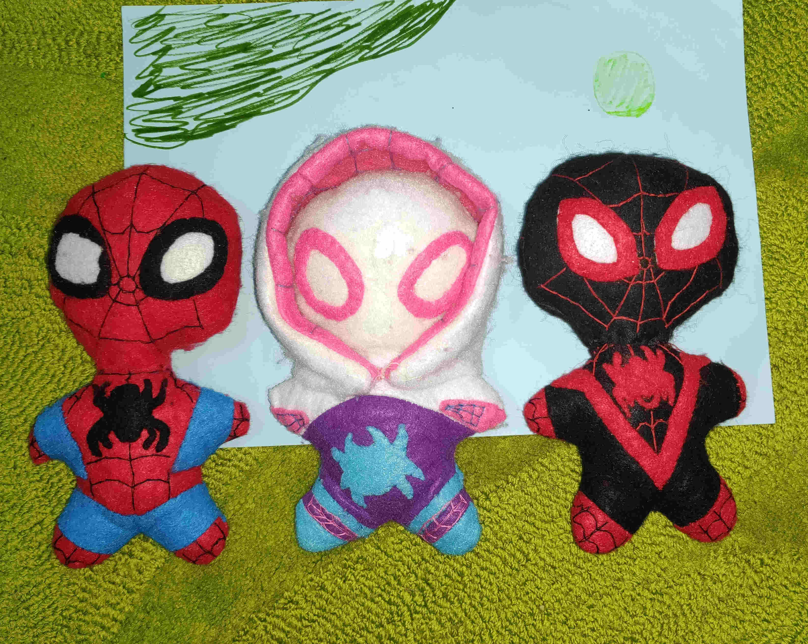
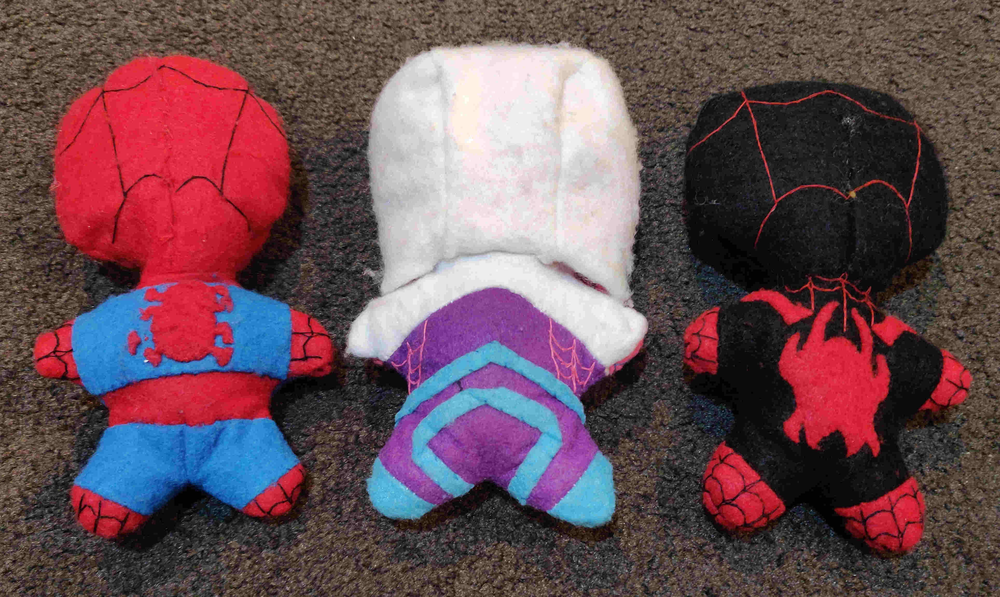

Project Date: May 2023

My daughter discovered ["Spidey and His Amazing Friends"](https://en.wikipedia.org/wiki/Spidey_and_His_Amazing_Friends_(2021_TV_series){target="_blank"}) on Youtube Kids. She still has [the Spiderman and Spider-Gwen soft toys](/posts/spider-gwen-soft-toy) I made her in 2016, but she wanted new ones that look like the new animated series spider characters. So, we went to Spotlight and bought more sheets of felt in all the required colours. While we were in Spotlight she also saw a mermaid scale print fabric that she really liked and wanted a mermaid outfit. That resulted in us looking through catalogues and then finding the patterns for a skirt and top (maybe I'll write another post with pictures).

Back to Spidey and his Amazing Friends. I modified the pattern for Spider Gwen's hood to be bigger so that the ends could connect down under her chin. The previous Spider Gwen's eye outlines were sewn with thread, so to make them stand out more this time, I cut and sewed on felt. For the spider icons on their fronts and backs, I ended up cutting these free hand while looking at the images. I found it too difficult to use chalk to draw the outlines first.

I started with Spidey and I tried to sew this as neat as possible by sewing him entirely inside out using a sewing machine. I left a small opening (too small) with which to turn him inside out. I managed to do it, but the tight fit and forceful pushing damaged the felt. So for Spider Gwen and Miles, I sewed the head and body inside out separately, then attached the heads to the bodies sewing by hand from the outside. Some of the spider icons ended up wonky, and Spidey's spider on his back has a detached leg that occurred while turning him inside out.

  

  This page has been read ... times.

