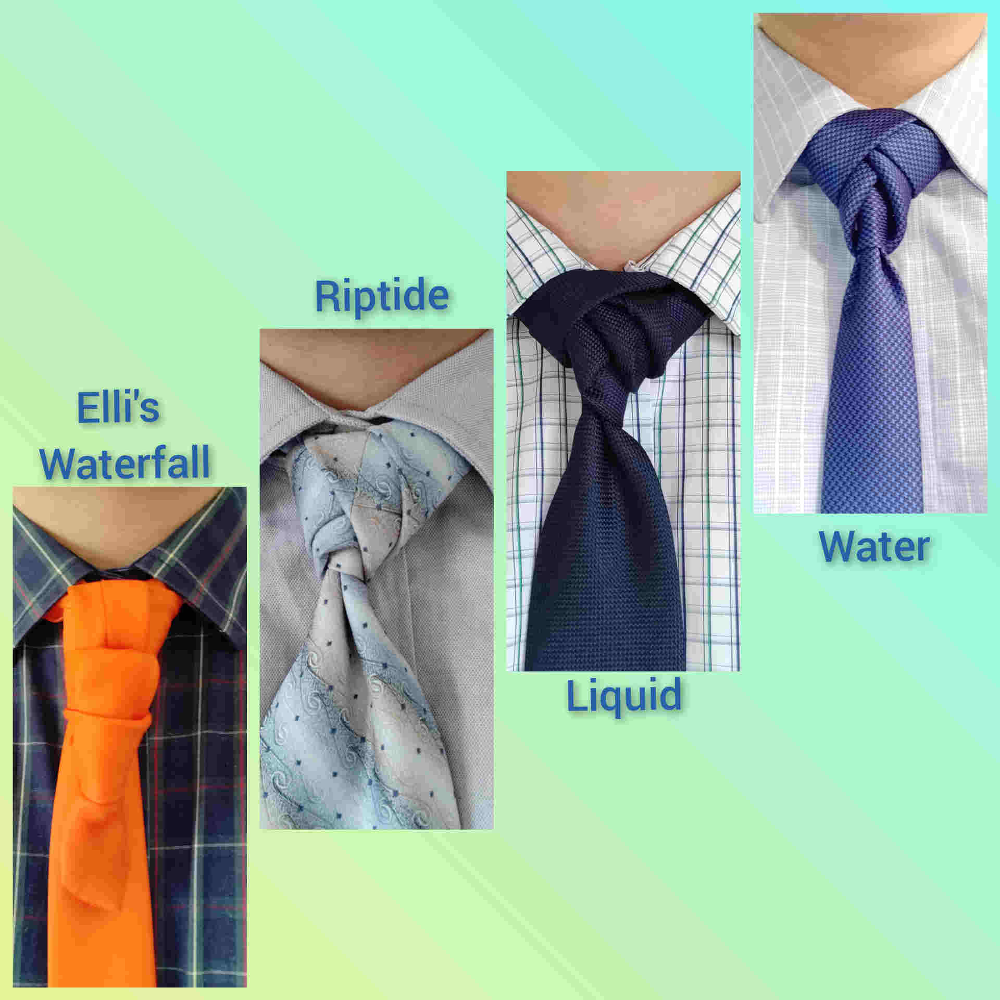
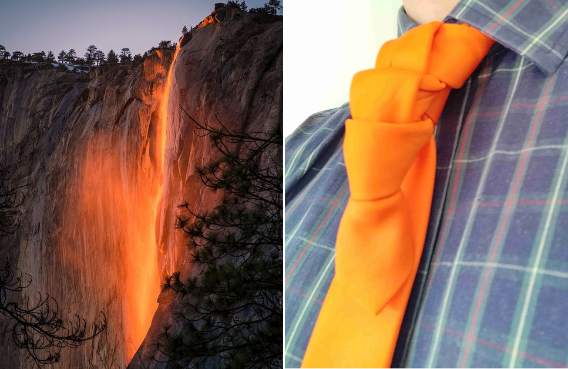

I have grouped together some knots with a "water" theme to them.

When I was watching the video on [Elli's Waterfall](https://www.youtube.com/watch?v=GhhAbppqaMk){target="_blank"}, my daughter initially suggested I use a blue tie. Then almost instantly, she changed her mind and told me instead to use my orange tie. She told me that orange would be the perfect colour for a waterfall in the setting sun. I told her it was a great idea, which led me to remember that I had heard of a lava waterfall somewhere before. An online search quickly brought up the [Yosemite Firefall](https://www.yosemite.com/a-guide-to-yosemites-natural-firefall-horsetail-fall/){target="_blank"}.

.
Yosemite firefall image found from the [Travel Caffeine website](https://www.travelcaffeine.com/yosemite-firefall-photography-tips/){target="_blank"}.

  

  

