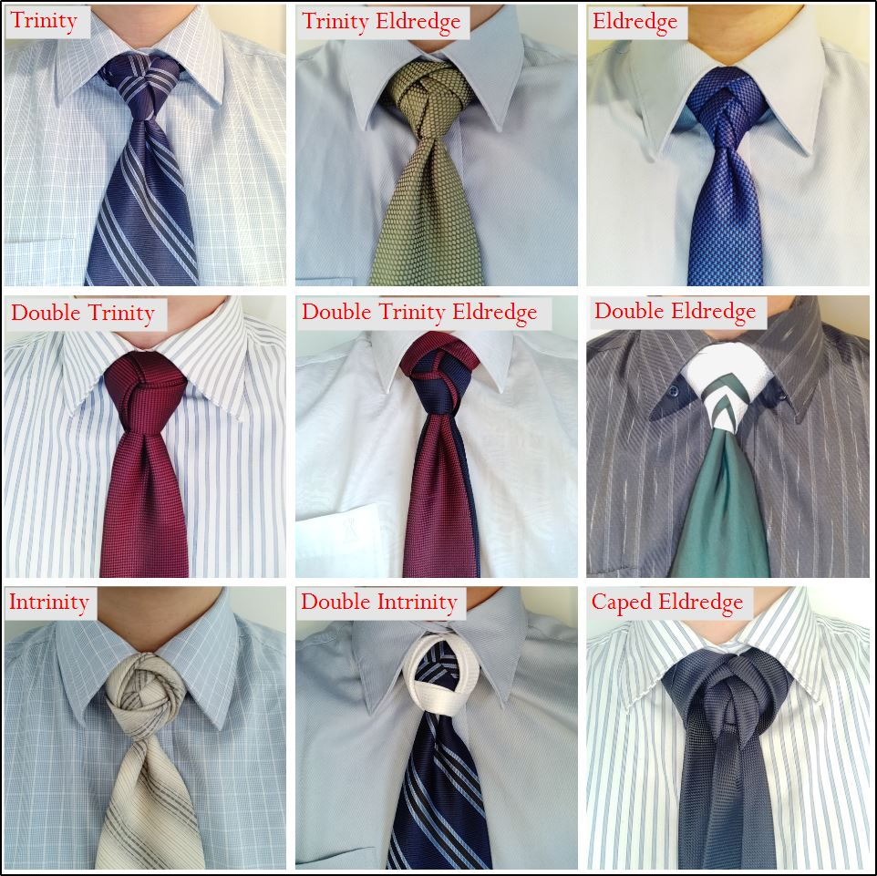

The two most widely known alternatives to the conventional knots are:

* Trinity
* Eldredge

I then found a number of variations on these, as well as a combination Trinity-Eldredge.

## Trinity
A striped tie works really well if you can align the stripes to the centre of the knot.

## Double Trinity
It is recommended to use a long tie for this knot.
I purchased long ties from the [Johnny Bigg](https://www.johnnybigg.com.au/nz/){target="_blank"} store in the Te Awa shopping mall.

## Double Eldredge
It really helps to have at least one thin material tie for this knot.

## Double Trinity Eldredge
Having tied the Trinity Eldredge, the Double Trinity, and the Double Eldredge, I started planning the collage image. I came up with the Double Trinity Eldredge myself, to form the first two rows of the collage. If one of the ties was a thin material tie, it would reduce the size of this bulky knot.

## Double Intrinity
I simplified this knot, as the [original "Lemnos" knot](https://www.youtube.com/watch?v=G11Be_KRWr8){target="_blank"} places a coin in the centre of the Trinity, which I did not want to do. Instead, I went for the striped tie for the Trinity portion.

## Caped Eldredge
This has been the most difficult tie knot so far in my tie journey. This knot starts off being tied draped over one hand and using the index finger to stand in as the front loop (that is usually at the front of the neck). Patience and practice is required to get the Eldredge knot tied over a finger. The challenge then increases with the next step of threading the large end of the tie (blade) in through the gap left by withdrawing the index finger from the middle of the Eldredge knot. This is then looped over the neck with the Caped portion being completed using the large end of the tie.

  

  This page has been read ... times.

